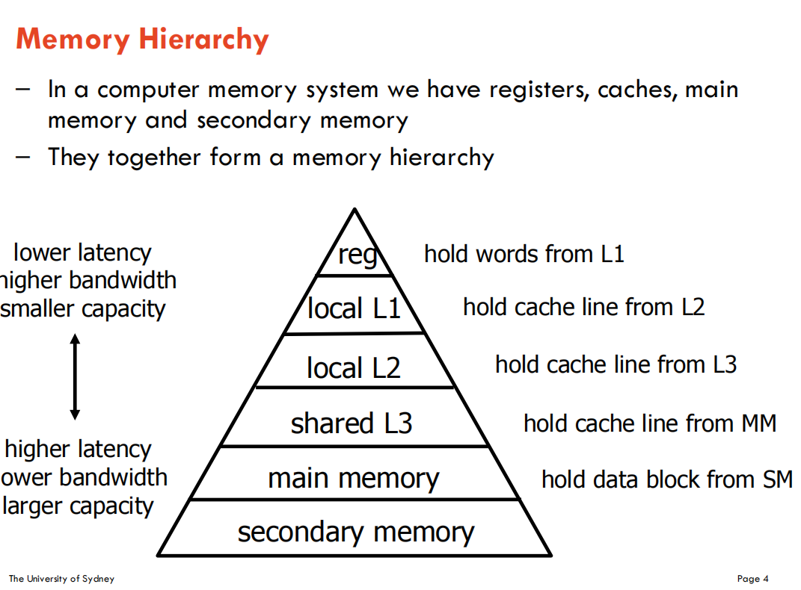
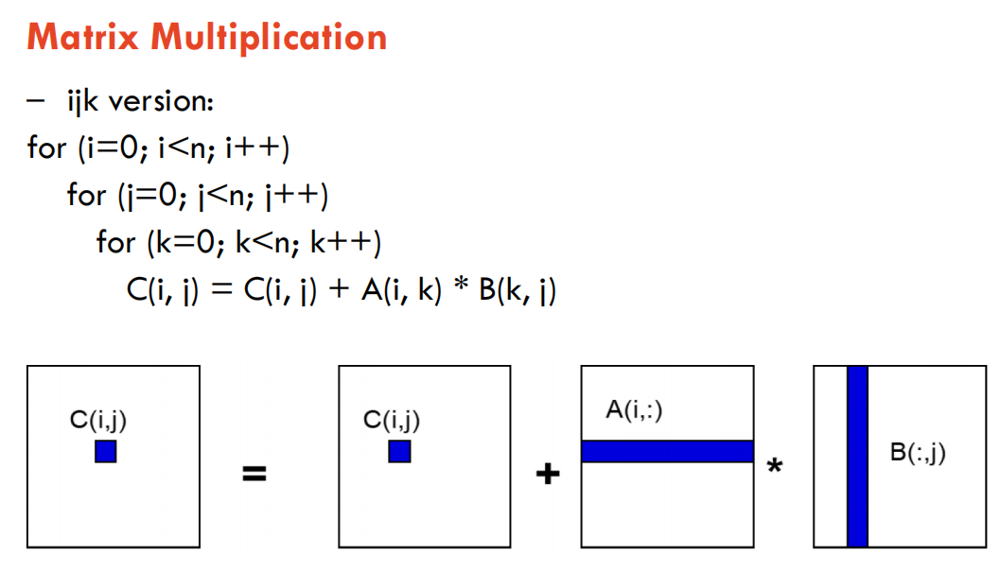
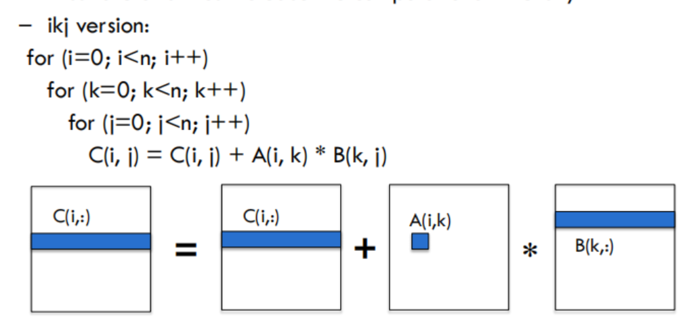

# 内存层次结构

- 大多数未经优化的并行程序运行时，性能不到机器峰值性能的10%
    - 单处理器上回损失大量性能
    - 这种性能损失大多发生在内存系统中
- 高速缓存(Caches)、寄存器(registers)和指令集并行(ILP)由硬件和编译器管理
    - 有时他们能做到最佳处理，有时做不到
- 我们需要编写程序，让硬件和编译器更清楚如何处理，以便它们能够更好地优化代码，实现高性能。

在计算机内存中，存在寄存器、高速缓存、主存和辅助内存。它们共同构成了内存层次结构。

|层级|特点|功能|
|--|--|--|
|reg(寄存器)|低延迟、高带宽、小容量|存放来自一级缓存(L1)的数据|
|local L1(本地一级缓存)||存放来自二级缓存(L2)的数据|
|local L2(本地二级缓存)||存放来自三级缓存(L3)的缓存行|
|local L3(共享三级缓存)||存放来自主内存(MM)的缓存行|
|main memory(主内存)|高延迟、低带宽，大容量|存放来自辅助内存的(SM)的数据块|
|secondary memory(辅助内存)|||

大多数程序都具有高度的局限性：
- 空间局限性：访问与之前访问位置相近的元素。
- 时间局限性：重用之前访问过的元素。

我们可以利用内存层次结构来提升性能：
- 将值存储在小型快速内存（高速缓存或寄存器）中并重复使用
    - 时间局部性（之前访问过的元素再次被使用）
- 将一大块连续数据存入高速缓存（或向量寄存器）并使用整块数据
    - 空间局部性（访问与之前访问位置相近的元素）

# 计算强度

假设内存层次结构只有两级：快速内存和慢速内存。  
所有数据最初都在慢速内存中。  
同时我们假设:
- m=在快速内存和慢速内存之间移动的内存单元（字）数量
- tm=每次慢速内存操作的时间
- f=算术运算的数量
- tf=每次算术运算的时间，且tf<<tm(tf远小于tm)

当所有数据都在快速内存中时，最短耗时为f*tf  
实际耗时为f*tf+m*tm  
其中q=f/m，即每次慢速内存访问的平均浮点运算次数，也就是计算强度（这是算法效率的关键 ）

# 提升单机性能
提高计算强度
- 降低缓存未命中率
    - **连续内存访问**：计算机内存中数据是连续存储的，按顺序访问相邻内存地址的数据，能充分利用缓存行机制，使所需数据大概率已在缓存中，减少从主存读取，提升访问速度。比如遍历数组时按顺序访问元素。
    - **分块**：将大的计算任务划分为小的数据块进行处理。让数据能在缓存中驻留更长时间，增加数据复用率，减少缓存未命中。例如矩阵乘法中采用分块算法。
- 高效利用寄存器
        - **循环展开**：将循环体代码重复展开几次，减少循环控制指令开销，让编译器更好地调度指令，充分利用寄存器资源，提高指令并行度，进而提升性能 。

# 矩阵的乘法

慢速内存访问次数为m=n³+n²+2n²

算术运算次数f，每次计算有n次乘法和n次加法，一共有n*n个元素，f=2n³

对于较大的n，计算强度q=f/m=2n³/n³+3n²≈2

问题是快速内存太小，无法容纳矩阵B

# 连续内存访问

数据在缓存和主内存之间以缓存行为单位进行传输。缓存行是缓存与主存间数据的基本数据传输的基本单元

连续内存访问对于降低缓存未命中率、进而提高计算计算强度即为重要。即计算机内存中数据连续存储，按顺序访问相邻内存地址数据，能让所需数据大概率已经在缓存中。进而提高计算强度。

改进后：

- 数据以缓存行的形式加载到缓存中。
- 二维矩阵先以行优先顺序存储在内存中。即先存储完一行元素，再存储下一行，这种存储方式决定了后续内存访问的模式
- 假设缓存行可容纳L个字，那么访问每一行仅需要n/L次慢速内存访问。
- m=n²/L+n³/L+2n²/L
- q=f/m=2L

# 分块技术
- 分块
将数据划分为多个块，使每个块能适配到缓存中。这样做是因为缓存容量有限，把大数据集分割成小块，能让数据更容易缓存  
尽量在数据从缓存中被替换出去之前，多次使用一个块中的数据。利用程序的时间局部性原理，减少重复从慢速主存读取相同数据，提高缓存利用率。

- 分块矩阵乘法
考虑矩阵A、B、C（大小为n×n），将它们视为由N×N个b×b子块组成的矩阵，其中b=n/N为块的大小

慢速缓存访问的次数：m=N*n²+N*n²+2n²

q=f/m=b

# 循环展开

- 循环展开是一种循环变换技术，有助于优化程序的执行时间。它通过对循环结构进行改造，提升程序运行效率。
- 减少分支开销：即减少控制循环的指令，例如每次迭代中的指针运算和“循环结束”测试
- 有效利用多个寄存器：通过将数据项预加载到寄存器中，减少对内存带宽的需要，寄存器访问速度远快于内存，把常用的数据存到寄存器，可避免频繁从内存读取，充分利用寄存器资源，提升数据访问速度。
- 提高计算强度：将数据项加载到寄存器中并多次使用。